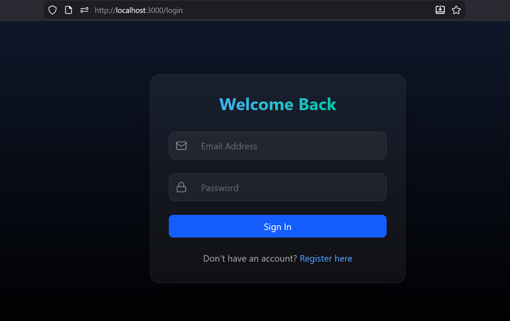
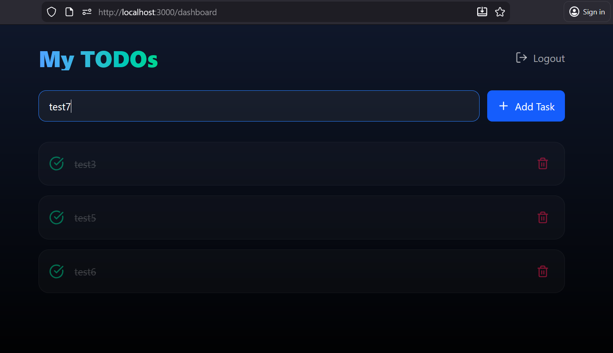
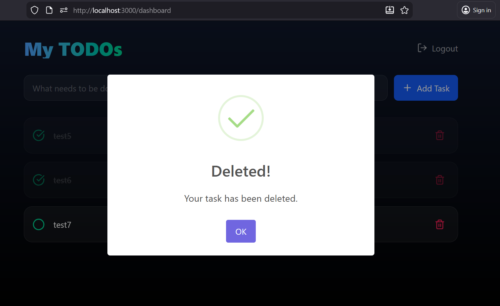

# Full-Stack TODO App (Next.js + NestJS + MySQL + JWT)

A premium, modern TODO application with a beautiful Glassmorphism UI, featuring secure user authentication and persistent database storage.

## ✨ Features

- **🛡️ Secure Authentication**: JWT-based Signup and Login.
- **📝 TODO CRUD**: Create, Read, Update (Toggle), and Delete tasks.
- **💎 Premium Design**: Sleek dark mode with glassmorphism using Tailwind CSS v4.
- **🔔 Interactive Feedback**: Custom SweetAlert2 notifications for all actions.
- **🔗 Relational Database**: MySQL with User-Todo relations.
- **📱 Responsive Layout**: Fully optimized for mobile and desktop.

## 🚀 Tech Stack

- **Frontend**: [Next.js 15](https://nextjs.org/) (App Router), Tailwind CSS v4, Lucide Icons.
- **Backend**: [NestJS](https://nestjs.com/), TypeORM.
- **Database**: MySQL.
- **Auth**: Passport.js + JWT.

## 🛠️ Step-by-Step Setup

### 1. Prerequisites
- Node.js (v18+)
- MySQL (XAMPP / Laragon / MySQL Server)

### 2. Database Connection
1. Open **phpMyAdmin** or your preferred SQL client.
2. Create a database named `todo_db`.
3. (Optional) Import the provided `database.sql` file. The backend will also auto-generate tables on startup.

### 3. Backend Setup (NestJS)
```bash
cd backend
npm install
npm run start:dev
```
- The backend will run on `http://localhost:3001`.

### 4. Frontend Setup (Next.js)
```bash
cd frontend
npm install
npm run dev
```
- The frontend will run on `http://localhost:3000`.

## 📸 Screenshots

### Authentication
| Login Page | Register Page |
| :---: | :---: |
|  |  |

### Dashboard & Operations
| Dashboard | Delete Confirmation | Delete Success |
| :---: | :---: | :---: |
|  |  |  |


## 📁 Project Structure

```text
├── backend/            # NestJS Backend source
├── frontend/           # Next.js Frontend source
├── database.sql        # MySQL Schema
├── screenshots/        # UI Screenshots
└── .gitignore          # Root ignore file
```

## 📜 Database Schema

The app uses two main relational tables:
- **Users**: Stores encrypted credentials.
- **Todos**: Stores tasks linked to specific users via `userId`.

